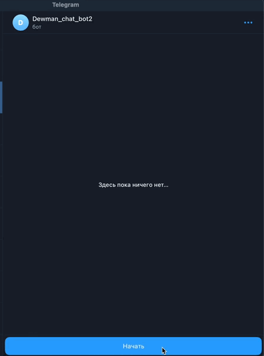

# Бот помощник для тех поддержки

## Описание
Данная программа подключается к  [Telegram](https://telegram.org/) и [VK](https://vk.com), и используя нейросети от [Dialog_flow](https://dialogflow.cloud.google.com) для ответов на вопросы.
## Как установить
 - Склонировать проект
```shell
git git@github.com:Andrey7777777777/Dewman_chat_bot_2.git
```
 - Установить requirements.txt
```shell
pip install -r requirements.txt
```
 - Создать файл .env и заполнить в нем переменные:
 
```dotenv
TELEGRAM_TOKEN = 'токен бота от имени которого будут идти оповещения'
```
```dotenv
TG_CHAT_ID = 'ID телеграм бота'
```
```dotenv
VK_API_TOKEN = 'API токен ВКонтакте'
```
```dotenv
PROJECT_ID = 'ID проекта Dialog_flow'
```
```dotenv
GOOGLE_APPLICATION_CREDENTIALS = 'путь до файла json c аутентификационными данными Dialog_flow'
```
## Запуск
Запуск телеграм бота
```shell
python dialogflow_bot_tg.py
```
Запуск VK бота
```shell
python chat_bot_vk.py
```
## обучение бота
Загрузка обучающих фраз в Dialog_flow
```shell
python create_intent.py
```
Для обучения нужно разместить файл в формате json с данными для обучения

Также вы можете передать скрипту путь до файла с фразами и ответами, например:
```shell
python create_intent.py -fp C:\Users\user\Desktop\new_intent.json
```

## Примеры использования
[телеграм бот](https://t.me/Dewman_chat_bot)


[VK_bot](https://vk.com/club221718184)

В качестве тестирования к нейросети подключены интент "Приветствия" и интент "Устройство на работу"

## Цель проекта
Код написан в рамках самостоятельного проекта на онлайн-курсе для веб-разработчиков [Devman](https://dvmn.org).